# Daily Listing Taste-Filter Agent

This project runs as a scheduled GitHub Actions workflow. It ingests listings, applies deterministic filters, uses OpenAI only for title/spec screening, classifies visual taste locally with CLIP embeddings and a small category-specific logistic-regression model, and sends a digest when qualifying listings exist.

## Architecture

```mermaid
flowchart LR
    sources["eBay Browse API\nInvaluable email / enrichment"] --> ingest["Ingest and normalize"]
    ingest --> listings[("listings")]
    listings --> rules["Deterministic filters\nprice, keywords, size"]
    rules -->|passed| title["OpenAI title/spec gate\nbatched, optional fast-track"]
    title -->|category| candidate["Listing image"]
    candidate --> embed["CLIP image embedding"]
    refs["Labeled reference images\nlike / dislike"] --> storage[("Supabase Storage")]
    refs --> refdb[("taste_references\nembeddings + labels")]
    storage --> embedrefs["CLIP reference embeddings"]
    embedrefs --> refdb
    refdb --> train["Fit category-specific\nlogistic classifier"]
    train --> taste["Local taste prediction\nlike / dislike / uncertain"]
    embed --> taste
    title --> judgments[("ai_judgments")]
    taste --> judgments
    judgments --> digest["Digest email"]
    digest --> feedback["User Like / Dislike feedback"]
    feedback -->|manual import / future IMAP ingestion| refs
```



The title gate is the only model step that consumes LLM tokens. Visual taste prediction does not send listing or reference images to OpenAI: CLIP converts images to vectors, and the local classifier learns the user's preference boundary from those vectors. Classifiers are refit from all active labels on each run, so new feedback changes subsequent predictions without LLM fine-tuning.

## Remote Setup

### 1. Create services

Create or obtain:

- A Supabase project with Postgres
- A private Supabase Storage bucket named `taste-references`
- An OpenAI API key
- Gmail IMAP access with a Google App Password
- eBay developer application credentials
- A FreeCurrencyAPI key
- An authorized ZenRows API key for remote Invaluable enrichment
- A Google Cloud Translation API key for translating non-English digest descriptions (optional)

### 2. Add GitHub Actions secrets

In the repository, open **Settings → Secrets and variables → Actions → New repository secret** and add:

```text
DATABASE_URL
OPENAI_API_KEY
GOOGLE_TRANSLATE_API_KEY
SUPABASE_URL
SUPABASE_SERVICE_ROLE_KEY
ZENROWS_API_KEY
EBAY_CLIENT_ID
EBAY_CLIENT_SECRET
EBAY_REFRESH_TOKEN
EBAY_MARKETPLACE_ID
IMAP_HOST
IMAP_PORT
IMAP_USERNAME
IMAP_PASSWORD
IMAP_FOLDER
FREECURRENCYAPI_KEY
SMTP_HOST
SMTP_PORT
SMTP_USERNAME
SMTP_PASSWORD
DIGEST_FROM
DIGEST_TO
```

For Gmail, use:

```text
IMAP_HOST=imap.gmail.com
IMAP_PORT=993
SMTP_HOST=smtp.gmail.com
SMTP_PORT=587
```

`IMAP_PASSWORD` and `SMTP_PASSWORD` may use the same Google App Password. `IMAP_USERNAME` receives Like/Dislike feedback replies. `DIGEST_TO` receives the digest.

Never put secret values in workflow YAML or committed configuration files.

Non-English descriptions are detected before the digest is rendered and translated in batches through Google Cloud Translation Basic. Results are cached in `description_translations` by a hash of the original description, so unchanged descriptions do not consume another request. Usage is tracked in `translation_usage_monthly` and hard-capped at 500,000 source characters per calendar month. Once the cap is reached, no more translation API requests are made. Translated entries are labeled `TRANSLATED FROM XX`. If the API key is unavailable or a batch fails, the original description is retained.

### 3. Apply repository configuration

The workflow uses these committed files:

- `config/searches.json`: saved searches, price limits, required sizes, exclusions, and categories
- `config/ai.json`: title-gate model/instructions, output budget, and LLM bypass rules; legacy taste settings are retained for compatibility
- `config/digest.json`: whether the verification digest includes filtered listings
- `db/schema.sql`: idempotent Postgres schema and migrations
- `.github/workflows/daily-listings.yml`: schedule and pipeline steps

Commit configuration changes to the repository. Do not edit secrets into these files.

### 4. Enable the workflow

After the workflow file is present, open the repository’s **Actions** tab, select the daily listings workflow, and use **Run workflow** for the first remote test. Later runs use the configured schedule.

## Search Configuration

Edit `config/searches.json`. The top-level `sources` object is the source registry. Each source declares its own `enabled` gate, adapter module, and searches:

```json
{
  "sources": {
    "my-source": {
      "enabled": true,
      "adapter": "my_source",
      "searches": []
    }
  }
}
```

To add a source, add one registry entry and its adapter module under `listing_agent/`. The runner, filtering, and AI stages discover enabled registry entries automatically; they do not need source-name edits. A source with `enabled: false` is skipped before credentials are read or its adapter is imported.

Within each source’s `searches` array, edit:

- eBay uses the official Browse API; eBay pages are not scraped.
- Set `max_price_usd` once on each source to apply a local USD price cap to all of that source's searches.
- eBay account searches support source-level `saved_search_defaults`, including `limit` and Browse API `sort` (for example, `bestMatch`), to control how many ranked results are ingested per search.
- Set `account_saved_searches` to `true` to retrieve the authenticated eBay buyer's Saved Searches through `GetMyeBayBuying`; this requires `EBAY_REFRESH_TOKEN`.
- When `account_saved_searches` is enabled, the account's saved searches are the complete eBay search set; entries in that source's `searches` array are ignored.
- Invaluable uses listing-alert emails from the configured inbox.
- `max_price_usd` and `required_size_fields` are deterministic filters applied before LLM calls.
- `allowed_size_fields` can be set on a source to apply one size allowlist to every search, including eBay account saved searches. For example, `{"waist": [28, 29, 30], "shoe_size": [8, 8.5]}`.
- Deterministic outcomes are stored in `listings.filter_reason`; AI title and taste outcomes are stored separately in `ai_judgments.title_reason` and `ai_judgments.taste_reason`.
- `limit` is the maximum number of source results ingested; `max_price_usd` is the price threshold. They are not duplicates.
- eBay listings are only inserted once, using the stable eBay item ID or normalized listing URL; previously seen items are not refreshed into the daily digest.
- `category` must be `art`, `home_decor`, or `clothing` and selects the matching reference pool.
- `enrichment_provider` selects the configured page-fetch adapter; this project uses authorized `zenrows`.
- Set `enabled` to `false` to pause a search.

Example Invaluable price limit:

```json
"max_price_usd": 200
```

## AI Configuration

Edit `config/ai.json`.

- `model`: model used for title/spec screening; visual taste is classified locally from CLIP embeddings
- `title_gate.instructions`: title and structured-spec screening prompt
- `taste_judgment.instructions`: retained for configuration compatibility; visual taste no longer spends LLM tokens
- `max_completion_tokens`: output budget
- `reference_limit` and `reference_pool_limit`: retained for compatibility with older nearest-reference runs; the classifier trains on every active labeled reference in the category.
- `pre_llm_policy`: deterministic bypass rules

Fast-track matching Invaluable email subjects are accepted without any OpenAI call. eBay and unmatched generic Invaluable subjects use the LLM title/spec gate, then local CLIP logistic regression handles taste.

Import additional feedback with `python -m listing_agent.cli import-references --directory <dir> --label like` or `--label dislike`. The directory must contain the existing category folders (`pinterest_art`, `pinterest_clothes`, or `pinterest_home_decor`). Embeddings are persisted in `taste_references`; each judgment run refits the small category-specific classifier from all active labels, so new feedback is incorporated automatically.

Example:

```json
"pre_llm_policy": {
  "invaluable": {
    "fast_track_subject_contains": ["Josef Albers", "Sabra Field"]
  }
}
```

Keep the fast-track list limited to searches that are safe to accept without title or image judgment.

## Reference Images

Reference images live in the private Supabase Storage bucket `taste-references`. Database rows keep their category, label, and portable storage path. The workflow uses signed URLs only when it needs to create a missing CLIP embedding; taste references are not sent to OpenAI.

Keep `art`, `home_decor`, and `clothing` pools separate. Each pool gets its own classifier, and examples use `like` or `dislike` labels.

## Workflow Behavior

Each scheduled run should:

1. Install project dependencies in the GitHub runner.
2. Apply `db/schema.sql` safely.
3. Ingest enabled eBay and Invaluable searches.
4. Apply deterministic price, keyword, and size filters.
5. Fast-track configured subjects without LLM calls.
6. Run the title/spec gate for remaining listings, then classify visual taste locally from CLIP embeddings.
7. Send one consolidated digest only when listings pass all required stages.
8. Record judgments and digest delivery state in Supabase.

Invaluable email ingestion remains the baseline if browser enrichment encounters a WAF or page challenge. Auction end dates are stored when available and displayed as `X Days Remaining | Sale on DATE`.

The Invaluable ingestion step logs enrichment counts, for example `invaluable enrichment: {'success': 2, 'fallback_email': 1}`. It also logs each failed listing's URL, attempt count, and retry errors. Listings store `enrichment_status`, `enrichment_attempts`, and (for failures) bounded `enrichment_error` and `enrichment_retry_errors` values in `raw_data`.

To inspect the latest persisted results in Supabase SQL Editor:

```sql
select title,
       raw_data->>'enrichment_status' as enrichment_status,
       raw_data->>'enrichment_attempts' as enrichment_attempts,
       raw_data->>'enrichment_error' as enrichment_error,
       sale_end_at
from listings
where source = 'invaluable'
order by fetched_at desc;
```

## Digest And Feedback

The digest is sent to `DIGEST_TO`, grouped by source, and includes USD price, sale timing when available, listing image, URL, concise reasoning, and an LLM usage footer for the title gate. Listing images are fetched transiently by the runner and embedded in the email; they are not retained in Supabase Storage. Fast-tracked digests report zero usage, and local taste classification adds no LLM usage.

Set `include_filtered` in `config/digest.json` to `true` while validating the service. Passed listings appear first; filtered listings appear in a clearly marked section with the same feedback controls. Set it to `false` after validation. A digest is never sent unless at least one listing passes filtering.

Like and Dislike buttons create pre-addressed replies to `IMAP_USERNAME`. Their subjects and bodies identify the listing so a later workflow can add feedback to the correct category pool.

If no listings have `filter_status = 'passed'`, no digest email is sent.

## Monitoring

Inspect the GitHub Actions run summary for connector failures. The workflow should fail loudly on ingestion errors and zero-item connector results rather than silently producing an empty result.
